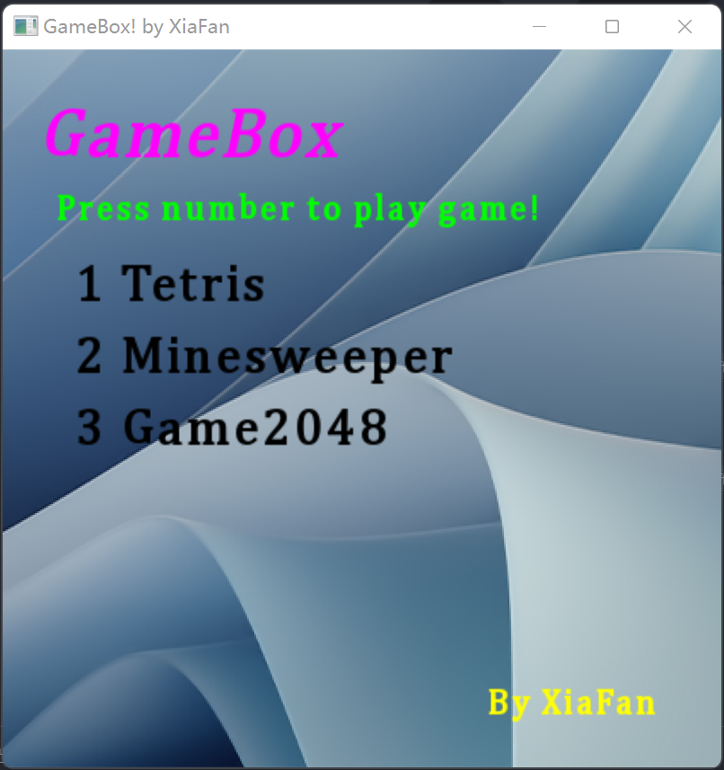
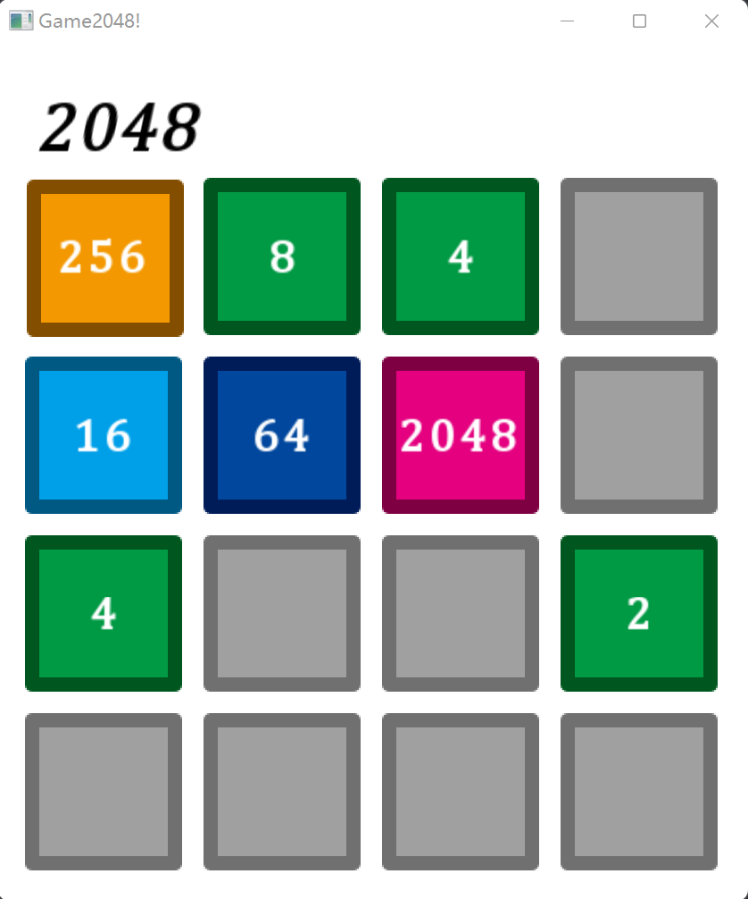

# 1. Gamebox 游戏盒子



## 1.1. 目录
- [1. Gamebox 游戏盒子](#1-gamebox-游戏盒子)
  - [1.1. 目录](#11-目录)
  - [1.2. 信息](#12-信息)
  - [1.3. 目前游戏列表](#13-目前游戏列表)
  - [1.4. build ( Windows ) : 使用模块 **`sfml`**](#14-build--windows---使用模块-sfml)
  - [1.5. 大体介绍](#15-大体介绍)
    - [1.5.1. Gamebox](#151-gamebox)
    - [1.5.2. Games](#152-games)
    - [1.5.3. base](#153-base)
    - [1.5.4. 2048](#154-2048)
    - [1.5.5. Minesweeper](#155-minesweeper)
    - [1.5.6. Tetris](#156-tetris)
    - [1.5.7. main](#157-main)

## 1.2. 信息

?

## 1.3. 目前游戏列表

- [x] Minesweeper ( 扫雷 )
- [x] Tetris ( 俄罗斯方块 ) ( 我上个大作业, 完善了一下 )
- [x] 2048
- [ ] 未完待续.. Snake 

时间有限，只能做这几个了，抱歉

## 1.4. build ( Windows ) : 使用模块 **`sfml`**

1. 安装 VS2022, cmake, git
2. 下载 [vcpkg](https://vcpkg.io)
3. vcpkg 安装 sfml:x64-windows
4. cmake 构建

## 1.5. 大体介绍 

### 1.5.1. Gamebox

其实我做的游戏感觉都很简单，都很小，于是想学习微软一样，把所有的内置小游戏集合到一起，展示一下。

### 1.5.2. Games

每一个模块就是一个窗户 **`sf::RenderWindow`** 。其中，游戏模块相对复杂，所有的游戏模块，实现，渲染，数据处理（游戏内核）是分离的  

每个游戏包含三个文件 `App` , `Render`, `Data`

我最先编写的是游戏内核，将他写为一个 **`Data`** 类，方便改变游戏大小（比如有几行，几列）  
接着，创建 **`Render`** 类继承 **`Data`** ，同时继承两个关键的绘制图像接口类 **`sf::Drawable`** ，**`sf::Transformable`** 实现绘制图像的接口需求。最后完善 **`int play()`** 函数，处理整个游戏运行逻辑。

游戏逻辑：
1. 创建窗口类，这是游戏画面渲染的载体。
2. 创建游戏类，运用 **`Render`** 实例化，当然，第一步是输入数据初始化，第二部载入游戏资源（比如图像，字体文件）。
3. 创建一些与游戏运行逻辑有关的变量，比如时间函数，记录游戏运行时间，或者记录键盘输入的变量。
4. 大循环，游戏需要不断进行并且更新，需要大循环。大循环的循环条件是窗口一直打开，一但窗口被关闭，游戏结束。
5. 在大循环中，需要接受用户信息，操作，鼠标键盘的输入，需要一个消息响应框架。
6. 在大循环中，游戏数据内容更新，带动游戏画面更新
7. 在大循环中最后一步，输出游戏画面，首先是清空窗口，然后载入背景，接着绘制所有游戏（各种方块，字体，图片），最后绘制窗口（display）。
8. 大循环结束后，是游戏结束收尾阶段，释放内存（自动）。

### 1.5.3. base

base 文件夹里面存放了有用的函数，主要是 **`Randomer`** ，这是一个线性均匀分布随机数字生成器  
使用方法：
1. ``` Randomer random(min, max); ``` 输入最大数字和最小数字进行实例化
2. ``` auto number = random(); ``` 用重载过的()函数调用，生成随机数字 

具体原理如下：
- 初始化时，用系统调用一个真随机数 `seed`
- 接着用随机数引擎生成分布
- 最后使用分布生成随机数

### 1.5.4. 2048



经典的2048游戏

> 在游戏中，`mat` 是承载方块内容的矩阵  

我在游戏里实现的功能：
- 上下左右的移动方块
- 依照数字大小展示方块颜色，区分明显

在这里最主要的函数：
- `void g2048::Data::rand_init(int num)` 
  初始化，运用随机函数，生成 `num` 个坐标，如果这个坐标没有数字，那么添加一个 **`2`**
- `bool g2048::Data::move_cells()`
  移动函数，这个函数接受 0 ~ 3 的数字代表四种方向上下左右
  ***双指针*** 的运作模式，`first` 指针首先指向将要被压缩到的第一个格子，`second` 指向第二个格子，遍历所有区间，将相等的合并，如果 `first` 为空，交换 `first` 和 `second` 内容。

### 1.5.5. Minesweeper


Minesweeper 扫雷是经典的游戏，在小时候没啥游戏可以玩的时候，我经常游玩。  
虽然在计算机资源贫瘠的年代，游戏一般不复杂，但是扫雷也有一些比较特别的处理思想。
从 Data 开始，游戏一步一步被生成。

> 游戏内有两个矩阵 `mat` 和 `vis`
> `mat` 是实际数据，包括雷的信息，和周围雷的数量
> `vis` 是现实信息，转化显示的图片，比如有没有插旗，或者展示周围雷的数量。游戏结束时展示全图信息

我在游戏里实现的功能：
- 重启游戏，其实就是将游戏矩阵依照初始化的方式格式化
- 右键插旗子
- 左肩点击查询区域

在这里最主要的函数：
- `void g2048::Data::rand_init()`
  初始化，运用随机函数，生成 `num` 个坐标，如果这个坐标没有雷，那么添加一个 **雷**
  与 `2048` 不同的是，随后还要计算每个格子周围雷的数量，通过四重循环遍历获得。
- `int g2048::Data::change(point)`
  接受鼠标点击信息，改变点击区域的可见度，这里用到了经典的图论算法 **`dfs`**
  首先改变当前节点可见度，变为可见，展示是否为雷，或者展示周围雷的数量，如果是雷，返回游戏结束信息
  如果周围没有雷，开始 `dfs`
- `void g2048::Data::dfs(point)`
  **`dfs`** （深度优先搜索算法 Depth First Search，简称DFS）  
  首先改变当前节点可见度，变为可见，展示周围雷的数量
  然后查询当前节点周围是否有雷，如果有，立即返回
  如果没有，递归搜索周边节点
- `void g2048::Data::flag(point)`
  即为右键功能，插上旗帜，表明这里有雷，或者取消，防止误触
- `point = sf::Mouse::getPosition(window)`
  与 2048，Tetris 不同的是，这个游戏必须要鼠标参与，这就涉及到坐标变换，从sf框架获得的实际坐标通过缩放变换获得原始坐标。游戏并不是全部内容都可以点击，所以坐标需要去掉这些区域，再点击时候需要判断点击和合法性，否则会出现内存访问错误，游戏终止。

### 1.5.6. Tetris

> 因为 Tetris ( 俄罗斯方块 ) 是我的上一份大作业，这里不做更多介绍了
> ~~这里拿过来凑数~~
> 整个框架重写了，结构更加合理，但是其实不计算在正式大作业内

### 1.5.7. main

所有的函数，游戏从这里开始，`main` 本身也包含了一个 `window`，在这里展示了所有可以游玩的游戏，在这里调用其他游戏的 `play` 接口。
